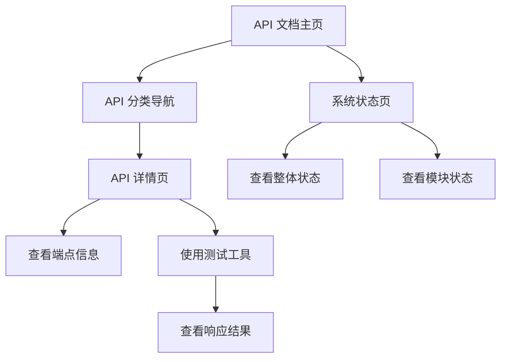

## 1. Product Overview
Naja 系统 API 文档和界面 - 为开发者提供优雅、易用的 API 文档和测试工具
- 提供 naja 系统各模块 API 的详细文档和交互界面
- 目标用户为系统开发者和分析师，便于他们快速了解和使用 naja 系统的 API 端点

## 2. Core Features

### 2.1 User Roles
| Role | Registration Method | Core Permissions |
|------|---------------------|------------------|
| Developer | No registration required | Browse API docs, test API endpoints |

### 2.2 Feature Module
1. **API 文档主页**: 系统概览、API 分类、快速导航
2. **API 详情页**: 端点详情、参数说明、响应示例、测试工具
3. **系统状态页**: 系统健康状态、模块状态

### 2.3 Page Details
| Page Name | Module Name | Feature description |
|-----------|-------------|---------------------|
| API 文档主页 | 系统概览 | 显示 naja 系统的整体架构和 API 分类 |
| API 文档主页 | API 分类导航 | 按模块分类展示 API 端点，支持快速筛选 |
| API 详情页 | 端点信息 | 展示 API 端点的路径、方法、参数、响应格式 |
| API 详情页 | 测试工具 | 提供在线测试功能，可发送请求并查看响应 |
| API 详情页 | 响应示例 | 展示 API 响应的示例数据 |
| 系统状态页 | 整体状态 | 显示系统的整体健康状态和关键指标 |
| 系统状态页 | 模块状态 | 展示各模块的详细状态信息 |

## 3. Core Process
用户访问 API 文档主页 → 浏览 API 分类 → 点击具体 API 端点 → 查看详情和示例 → 使用测试工具发送请求 → 查看响应结果

## 4. User Interface Design
### 4.1 Design Style
- 主色调: #3B82F6 (蓝色)、#10B981 (绿色)
- 辅助色: #6366F1 (紫色)、#F59E0B (橙色)
- 按钮样式: 圆角按钮，悬停效果
- 字体: Inter 字体，标题 18-24px，正文 14-16px
- 布局风格: 卡片式布局，清晰的层次结构
- 图标风格: 使用 Lucide 图标库，简洁现代

### 4.2 Page Design Overview
| Page Name | Module Name | UI Elements |
|-----------|-------------|-------------|
| API 文档主页 | 系统概览 | 大标题、简短描述、系统架构图、核心模块卡片 |
| API 文档主页 | API 分类导航 | 侧边栏导航、分类标签、搜索功能 |
| API 详情页 | 端点信息 | 路径显示、方法标签、参数表格、响应结构 |
| API 详情页 | 测试工具 | 请求构建器、参数输入、发送按钮、响应显示 |
| API 详情页 | 响应示例 | 代码块显示、语法高亮、复制按钮 |
| 系统状态页 | 整体状态 | 状态卡片、健康指标、系统概览图表 |
| 系统状态页 | 模块状态 | 模块列表、状态指示器、详细信息展开 |

### 4.3 Responsiveness
- 桌面优先设计，支持响应式布局
- 移动端适配：侧边栏折叠、卡片堆叠
- 触摸优化：按钮大小适合触摸操作

### 4.4 3D Scene Guidance
- 不适用，本项目为文档和工具类应用