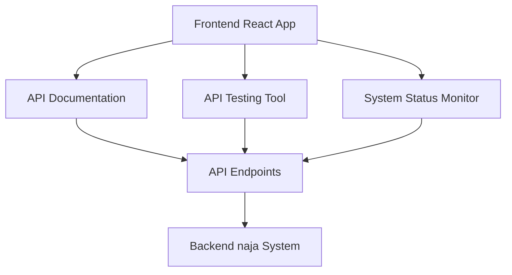

## 1. Architecture Design


## 2. Technology Description
- Frontend: React@18 + Tailwind CSS@3 + Vite
- Initialization Tool: vite-init
- Backend: None (直接调用 naja 系统的 API 端点)
- Database: None (使用 naja 系统的现有数据)

## 3. Route Definitions
| Route | Purpose |
|-------|---------|
| / | API 文档主页 |
| /api/:module/:endpoint | API 详情页 |
| /status | 系统状态页 |

## 4. API Definitions

### 4.1 API Endpoints
| Endpoint | Method | Description |
|----------|--------|-------------|
| /api/cognition/memory | GET | 获取认知系统记忆报告 |
| /api/cognition/topics | GET | 获取认知系统主题信号 |
| /api/cognition/attention | GET | 获取认知系统注意力提示 |
| /api/cognition/thought | GET | 获取认知系统思想报告 |
| /api/market/state | GET | 获取市场状态 |
| /api/market/hotspot/details | GET | 获取市场热点详情 |
| /api/system/status | GET | 获取系统状态 |
| /api/system/modules | GET | 获取系统模块状态 |
| /api/radar/events | GET | 获取雷达事件 |
| /api/bandit/stats | GET | 获取 Bandit 决策统计 |
| /api/datasource/list | GET | 获取数据源列表 |
| /api/strategy/list | GET | 获取策略列表 |
| /api/alaya/status | GET | 获取阿那亚觉醒状态 |

### 4.2 Request/Response Schemas

#### Response Schema
```typescript
interface ApiResponse {
  timestamp: number;
  datetime: string;
  success: boolean;
  data?: any;
  error?: string;
}
```

## 5. Server Architecture Diagram
- 不适用，本项目为纯前端应用，直接调用 naja 系统的 API 端点

## 6. Data Model
- 不适用，本项目使用 naja 系统的现有数据模型

## 7. Frontend Architecture

### 7.1 Component Structure
- App: 主应用组件
- Layout: 布局组件，包含导航栏和侧边栏
- HomePage: API 文档主页
- ApiDetailPage: API 详情页
- StatusPage: 系统状态页
- ApiCard: API 卡片组件
- ApiTestTool: API 测试工具组件
- StatusCard: 状态卡片组件
- ModuleStatus: 模块状态组件

### 7.2 State Management
- 使用 React Context API 管理全局状态
- 使用 useState 和 useReducer 管理组件级状态

### 7.3 Utilities
- api.ts: API 调用工具函数
- types.ts: TypeScript 类型定义
- utils.ts: 通用工具函数

## 8. Development Plan
1. 初始化 React 项目
2. 安装依赖包
3. 创建基础布局和导航
4. 实现 API 文档主页
5. 实现 API 详情页和测试工具
6. 实现系统状态页
7. 添加响应式设计
8. 优化 UI/UX
9. 测试和调试