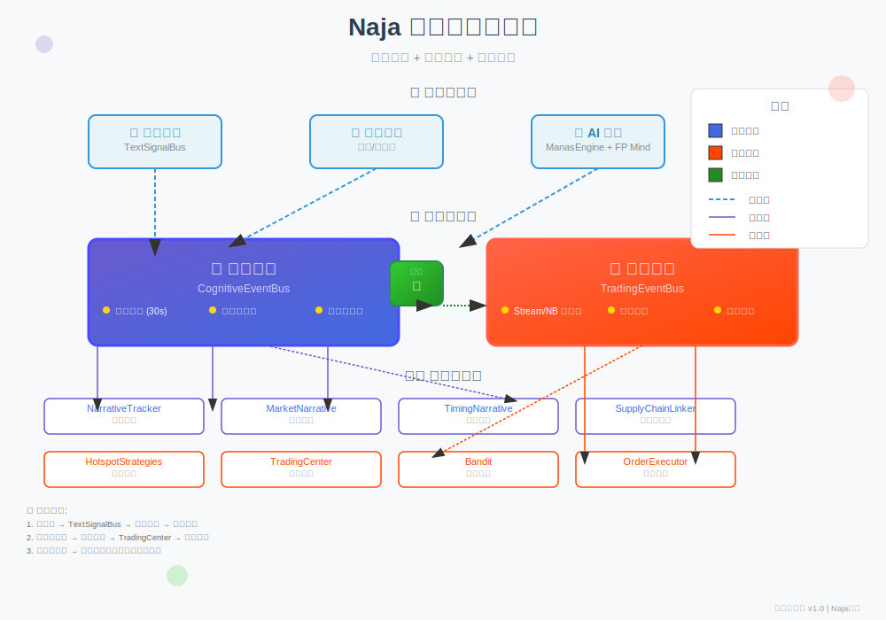

# 🏗️ Naja 系统双总线架构

## 📋 架构概述

Naja 系统采用**双总线架构**，分离**认知事件**和**交易事件**，通过**桥梁**按需连接，实现职责清晰、功能完整的事件驱动系统。

## 🎯 设计原则

### 1. 职责分离
- **认知总线** → 处理认知层内部信号：叙事更新、时机分析、风险检测等
- **交易总线** → 处理交易层信号：策略信号、交易决策、订单执行等

### 2. 保持现状
- 认知总线不变，继续使用 `publish_cognitive_event()` 接口
- 交易总线升级为 `StreamBackedEventBus`，支持持久化

### 3. 桥梁通信
- 重要认知事件可以转换为交易信号
- 交易决策可以反馈给认知层

## 🚀 架构图



## 📊 核心组件

### 🧠 认知总线 (CognitiveEventBus)
**位置**: `events/cognitive_bus.py`
**接口**: `get_event_bus()`

**核心特性**:
- ✅ **去重窗口** - 30秒内相同事件只发一次
- ✅ **重要性阈值** - 订阅者可设置 `min_importance`
- ✅ **模块级统计** - 精确追踪每个模块的接收情况
- ✅ **市场过滤** - 订阅者可限定接收的市场
- ✅ **高重要性告警** - 无人接收时发出警告

**主要事件类型**:
- `CognitiveEventType.NARRATIVE_UPDATE` - 叙事更新
- `CognitiveEventType.MARKET_REGIME_SHIFT` - 市场机制转换
- `CognitiveEventType.RISK_ALERT` - 风险告警
- `CognitiveEventType.SEMANTIC_GRAPH_UPDATE` - 语义图更新

### 💰 交易总线 (TradingEventBus)
**位置**: `events/trading_bus.py`
**接口**: `get_trading_bus()`

**核心特性**:
- ✅ **Stream/NB 持久化** - 关键事件自动存 SQLite
- ✅ **市场过滤** - 订阅者可限定接收的市场
- ✅ **链式操作** - 支持 `filter()`, `map()`, `rate_limit()`
- ✅ **去重窗口** - 30秒内相同事件去重
- ✅ **重要性阈值** - 订阅者可设置 `min_importance`

**主要事件类型**:
- `StrategySignalEvent` - 策略信号
- `TradeDecisionEvent` - 交易决策
- `OrderExecutionEvent` - 订单执行
- `HotspotComputedEvent` - 热点计算

### 🌉 总线桥梁 (BusBridge)
**位置**: `events/bus_bridge.py`
**接口**: `get_bus_bridge()`

**功能**:
- 按需连接认知总线和交易总线
- 重要认知事件自动转换为交易信号
- 交易决策反馈给认知层
- 可配置转换规则和重要性阈值

## 🔄 数据流向

### 1. 认知数据流
```
📰 新闻抓取
    ↓ TextSignalBus
    ↓ publish_cognitive_event()
🧠 认知总线
    ↓ 按模块分发
⚙️ 认知模块 (NarrativeTracker, MarketNarrative, ...)
    ↓ 处理并更新认知状态
```

### 2. 交易数据流
```
💰 热点策略
    ↓ emit_signal() → _publish_strategy_event()
🚌 交易总线
    ↓ TradingCenter 订阅处理
⚖️ ManasEngine + FP Mind + Alaya 融合决策
    ↓ 发布 TradeDecisionEvent
🚌 交易总线
    ↓ Bandit 订阅执行
🤖 Bandit 智能下单
    ↓ 订单执行系统
```

### 3. 跨总线通信 (桥梁启用时)
```
🧠 认知总线
    ↓ 高重要性认知事件 (importance ≥ 0.8)
🌉 桥梁连接
    ↓ 转换为 StrategySignalEvent
🚌 交易总线
    ↓ 触发交易决策流程
```

## 📁 文件结构

```
events/
├── __init__.py              # 统一导出接口，提供总线选择器
├── cognitive_bus.py         # 认知总线（保持原样）
├── trading_bus.py           # 交易总线（StreamBackedEventBus）
├── bus_bridge.py            # 总线桥梁（按需连接）
├── persistence_config.py    # 持久化配置
├── query_interface.py       # 历史查询接口
├── trading_events.py        # 交易事件定义
├── cognition_events.py      # 认知事件定义
├── hotspot_events.py        # 热点事件定义
└── text_events.py           # 文本事件定义
```

## 🛠️ 使用指南

### 场景1：现有认知模块（完全不改）
```python
from deva.naja.events import get_event_bus, CognitiveEventType

bus = get_event_bus()  # 返回认知总线
bus.publish_cognitive_event(
    source="NarrativeTracker",
    event_type=CognitiveEventType.NARRATIVE_UPDATE,
    narratives=["新能源政策加码"],
    importance=0.8,
    stock_codes=["000001"]
)
```

### 场景2：新交易模块（推荐新代码）
```python
from deva.naja.events import get_trading_bus, StrategySignalEvent, SignalDirection

bus = get_trading_bus()
signal = StrategySignalEvent(
    symbol="000001",
    direction=SignalDirection.BUY,
    confidence=0.85,
    strategy_name="BlockRotationHunter"
)
bus.publish(signal)
```

### 场景3：简单选择器（统一接口）
```python
from deva.naja.events import publish_event, subscribe_event

# 订阅跨总线事件
subscribe_event('StrategySignalEvent', lambda e: print(f"收到信号: {e.symbol}"))

# 发布事件，自动选择总线
from deva.naja.events.trading_events import StrategySignalEvent
publish_event(StrategySignalEvent(symbol="000001", ...))
```

### 场景4：启用桥梁连接
```python
from deva.naja.events import get_bus_bridge

bridge = get_bus_bridge()
bridge.enable_bridge(True)  # 启用跨总线通信
bridge.set_importance_threshold(0.7)  # 只转发重要性≥0.7的事件
```

## 📈 统计与监控

### 认知总线统计
```python
bus = get_event_bus()
stats = bus.get_stats()

print(f"总发布事件: {stats.total_published}")
print(f"总分发事件: {stats.total_delivered}")
print(f"丢弃事件: {stats.dropped}")
print(f"按模块统计: {stats.by_module}")
```

### 交易总线统计
```python
bus = get_trading_bus()
stats = bus.get_stats()

print(f"策略信号: {stats.strategy_signals}")
print(f"交易决策: {stats.trade_decisions}")
print(f"持久化事件: {stats.persisted_events}")
```

## 🔍 历史查询

```python
from deva.naja.events.query_interface import EventQuery

query = EventQuery(get_trading_bus())

# 查询近期策略信号
signals = query.query_strategy_signals(
    symbol="000001",
    direction="buy",
    days=7,
    limit=50
)

# 获取统计信息
stats = query.get_stats('StrategySignalEvent', days=30)
```

## 🎯 迁移路径

### ✅ 已完成迁移
1. **热点策略** → 使用交易总线发布信号
2. **Bandit** → 订阅交易总线的 TradeDecisionEvent
3. **TradingCenter** → 使用交易总线发布决策

### ⏳ 待迁移（可选）
1. 认知模块 → 逐步迁移到统一接口
2. UI展示 → 集成交易总线持久化数据
3. 监控系统 → 集成两个总线的统计

## 📋 架构优势

### 1. 零迁移风险
- 现有认知模块完全不用改
- 认知总线的所有特殊功能都保留

### 2. 功能完整
- 统计、模块管理、重要性告警 → 认知总线
- 持久化、链式操作、市场过滤 → 交易总线

### 3. 职责清晰
- 认知归认知，交易归交易
- 桥梁只在需要时连接

### 4. 渐进演进
- 新模块用新总线，老模块不动
- 按需启用桥梁连接

## 🚀 下一步计划

1. **系统启动测试** - 确认清理后系统正常工作
2. **桥梁集成测试** - 测试跨总线通信是否正常
3. **UI界面集成** - 在WebUI展示总线统计
4. **性能监控** - 监控两个总线的性能指标

---

**架构版本**: v1.0 (2026-04-13)
**设计者**: 虾丸 🦐
**状态**: ✅ 已实现，待系统集成测试