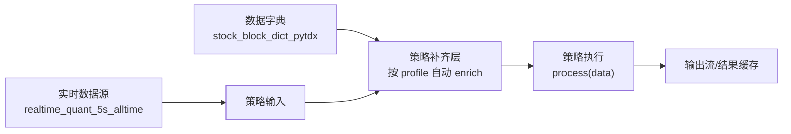

# Deva 数据字典 + 数据补齐 + 数据源到策略执行 E2E 使用说明

## 1. 目标

本文给出一套可落地、可复用的完整流程：

1. 构建并维护数据字典（以股票 `blockname/industry` 为例）。
2. 在策略执行前自动进行字典补齐（支持一股多板块/多行业）。
3. 创建实时数据源（5 秒定时，不判断开盘时间，持续抓取）。
4. 创建并运行依赖该数据源的板块分析策略。
5. 给出可直接在 Codex 中使用的一条龙生成案例。

---

## 2. 架构与数据流



关键点：
- 补齐发生在策略执行前。
- 策略可选择 1 个或多个字典 profile。
- 多值字段（`blockname`/`industry`）按分隔符展开后再分组统计。

---

## 3. 相关存储表（NB）

- 数据源定义：`NB("data_sources")`
- 策略定义：`NB("strategy_units")`
- 数据字典条目：`NB("data_dictionary_entries")`
- 数据字典载荷：`NB("data_dictionary_payloads")`
- 数据源最新数据快照：`NB("data_source_latest_data")`

---

## 4. 数据字典设计（以股票板块字典为例）

### 4.1 字典条目建议

- `name`: `stock_block_dict_pytdx`
- `dict_type`: `stock_basic_block`
- `schedule_type`: `daily`
- `daily_time`: `12:00`
- `enabled`: `true`
- `code`: 必须包含 `fetch_data()`，输出 DataFrame（至少含 `code, blockname, industry`）

### 4.2 字典代码模板（核心）

```python
def fetch_data():
    # 产出列至少包含: code, name, blockname, industry
    # blockname/industry 支持多值，统一使用 | 拼接
    return df
```

### 4.3 维护要求

- 必须有执行日志（下载、解析、行数、耗时、异常）。
- 需要支持异步执行。
- 需要支持“清空历史数据”按钮（清除 payload）。

---

## 5. 策略补齐机制（当前实现要点）

### 5.1 绑定方式

策略元数据中配置：
- `dictionary_profile_ids: ["<dict_entry_id>"]`

### 5.2 运行机制

1. 策略收到输入数据（DataFrame / tuple / list）。
2. 对每个 profile 依次执行 enrich：
   - 自动推断 join key（`code / ts_code / symbol / name`）。
   - 维表按 key 聚合，避免一对多被 `drop_duplicates` 丢失。
   - 非数值列多值去重后用 `|` 合并。
3. 产出补齐后的输入继续进入 `process`。

### 5.3 多值分隔支持

统一支持：
- `|`
- `,`
- `，`
- `;`
- `；`

---

## 6. 最新实战链路（当前环境）

### 6.1 数据源（已创建）

- 名称：`realtime_quant_5s_alltime`
- ID：`189e3042171a`
- 类型：`timer`
- 间隔：`5s`
- 特性：不判断交易时段，持续抓取

核心 `fetch_data`：

```python
def fetch_data():
    """全天持续获取实时行情，不判断交易时段"""
    return gen_quant()
```

### 6.2 数据字典（已创建）

- 名称：`stock_block_dict_pytdx`
- ID：`953b771d7e1d`
- 用途：补齐 `code -> name/blockname/industry`

### 6.3 策略（已创建）

- 名称：`板块涨跌幅极值Top10_5s`
- ID：`4477c568ae33`
- 绑定数据源：`realtime_quant_5s_alltime`
- 字典 profile：`["953b771d7e1d"]`
- 输出：涨幅最大 Top10 + 跌幅最大 Top10 板块

---

## 7. 一条龙：在 Codex 里直接生成（可复制）

下面三段是可直接发给 Codex 的操作指令。

### 7.1 指令 A：生成全天 5 秒实时数据源

```text
帮我创建一个数据源并写入 data_sources：
- 名称 realtime_quant_5s_alltime
- source_type=timer
- interval=5秒
- 数据获取逻辑参考 realtime_quant_5s，但不要做 is_tradedate/is_tradetime 判断，全天持续抓取
- 自动启动并回显 source_id、状态、核心 fetch_data 代码片段
```

### 7.2 指令 B：生成股票板块数据字典

```text
帮我创建数据字典并写入 data_dictionary_entries/data_dictionary_payloads：
- 名称 stock_block_dict_pytdx
- 每天12:00更新，enabled=true
- 目标字段至少 code,name,blockname,industry
- 支持异步执行、清空旧数据、必要日志打印
- 完成后回显 entry_id、payload 行数、字段列表
```

### 7.3 指令 C：生成并绑定策略

```text
帮我创建策略并写入 strategy_units：
- 名称 板块涨跌幅极值Top10_5s
- 绑定数据源 realtime_quant_5s_alltime
- 绑定字典 profile stock_block_dict_pytdx
- 统计板块平均涨跌幅，输出涨幅最大10个板块和跌幅最大10个板块
- 支持一股多板块（|,，,; 分隔）
- 创建后自动启动，并回显 strategy_id、运行状态、绑定关系
```

### 7.4 指令 D：E2E 验证

```text
请做端到端验证并输出结论：
1) 数据源是否有持续产出
2) 策略补齐后是否出现 blockname/industry 字段
3) 多板块字段是否保留 | 多值
4) 策略输出是否包含 Top10 / Bottom10
```

---

## 8. 策略代码模板（板块 Top10/Bottom10）

```python
def process(data):
    import pandas as pd

    if data is None:
        return '<p>暂无数据</p>'
    if not isinstance(data, pd.DataFrame):
        data = pd.DataFrame(data)
    if data.empty:
        return '<p>暂无数据</p>'

    if 'blockname' not in data.columns or 'p_change' not in data.columns:
        return '<p>缺少 blockname 或 p_change 字段</p>'

    df = data.copy()
    df['p_change'] = pd.to_numeric(df['p_change'], errors='coerce')
    df = df[df['p_change'].notna()].copy()

    def split_blocks(v):
        text = '' if v is None else str(v).strip()
        if not text or text.lower() in {'nan', 'none', 'null', 'unknown'}:
            return ['unknown']
        for sep in ['|', ',', '，', ';', '；']:
            text = text.replace(sep, '|')
        vals = [x.strip() for x in text.split('|') if x.strip()]
        return vals or ['unknown']

    df['blockname_item'] = df['blockname'].map(split_blocks)
    df = df.explode('blockname_item', ignore_index=True)
    df = df[df['blockname_item'] != 'unknown']

    grouped = (
        df.groupby('blockname_item', as_index=True)
          .agg(avg_p_change=('p_change', 'mean'), stock_count=('code', 'nunique'))
          .sort_values('avg_p_change', ascending=False)
    )

    top10 = grouped.head(10).copy()
    bottom10 = grouped.tail(10).sort_values('avg_p_change', ascending=True).copy()

    for tdf in (top10, bottom10):
        tdf['avg_p_change'] = (tdf['avg_p_change'] * 100).map(lambda x: f"{x:+.2f}%")

    return (
        '<h4>板块涨幅最大 Top 10</h4>' + top10.to_html() +
        '<h4>板块跌幅最大 Top 10</h4>' + bottom10.to_html()
    )
```

---

## 9. 常见问题与排查

1. 补齐未生效（输出没有 `blockname/industry`）
- 检查策略是否绑定了 `dictionary_profile_ids`。
- 检查 profile 对应条目是否存在且有 payload。
- 检查 join key 是否匹配（推荐使用 `code`）。

2. 多板块丢失
- 检查是否错误使用了 `drop_duplicates(code)` 直接覆盖。
- 应改为：按 `code` 聚合并将文本列多值 `|` 合并。

3. 字典显示正常但策略取不到
- 检查字典管理器是否已 load（当前实现已做 lazy load）。

4. 行业字段大量 unknown
- 这是字典数据质量问题，不是补齐链路问题。
- 需增强字典更新逻辑，提升 `industry` 覆盖率。

---

## 10. 最佳实践

- 把“变化慢、复用高”的维度数据放入数据字典（如板块/行业/地域）。
- 策略只关心计算逻辑，补齐交给 profile。
- 所有分组统计都默认按“多值展开”处理，避免一对多关系丢失。
- 每次改补齐逻辑后都做一次 E2E 回归：数据源产出、补齐字段、多值保留、策略结果。

